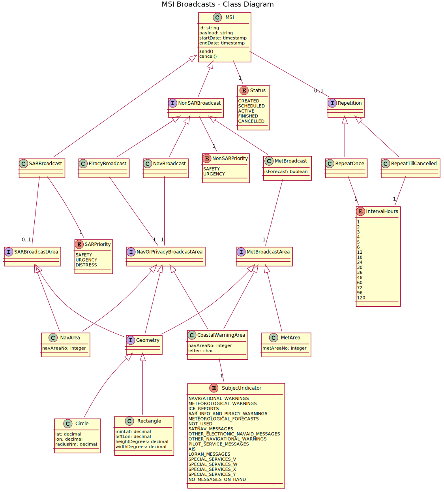

# Enhanced Group Call (EGC) API

This repository is a collaboration point to support the development of a common and fully-defined REST API to be implemented by EGC satellite service providers (currently Inmarsat and Iridium). 

The defacto standard for the definition of REST APIs is [OpenAPI v3](https://swagger.io/specification/) which is a YAML or JSON document. The YAML and JSON representations are equivalent, this site uses YAML format for its readability advantages.

The OpenAPI v3 definition for the EGC API is [openapi.yml](openapi.yml). 

Documentation generated from openapi.yml is [here](https://amsa-code.github.io/egc-api/) (and is updated using `scripts/update-gh-pages.sh`). 

Note that a number of design considerations are discussed in the opening description block of [openapi.yml](openapi.yml).

A useful tool for editing and visualizing the API in HTML documentation is at https://editor.swagger.io/.

## MSI Class Diagram

Below is a visualization of the data model of an MSI broadcast (as a [UML Class Diagram](https://en.wikipedia.org/wiki/Class_diagram)).

Notes:
* A SARBroadcast has zero or one SARBroadcastArea. When a SARBroadcastArea is not specified the whole coverage area is assumed.
* An MSI has zero or one Repetition. When a Repetition is not specified then the broadcast happens only once (there may still be the standard 6 minute echo). 
* An EGC satellite service provider should be able to map this model to C-Codes if desired (raise an issue if this is not the case)

