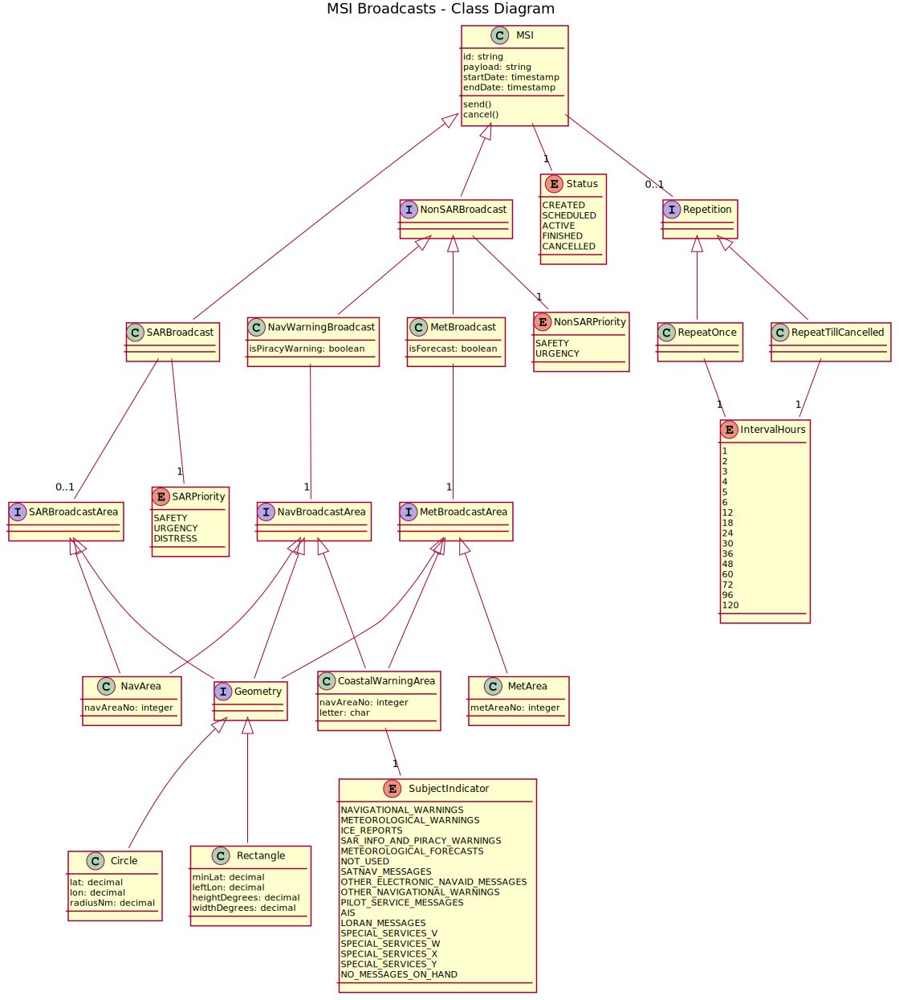

# Enhanced Group Call (EGC) API

This repository is a collaboration point to support the development of a common and well-defined API to be used by EGC service providers (currently Inmarsat and Iridium). 

The defacto standard for the definition of REST APIs is [OpenAPI v3](https://swagger.io/specification/) which is a YAML or JSON document. The YAML and JSON representations are equivalent, this site uses YAML format for its readability advantages.

The OpenAPI v3 definition for the EGC API is [openapi.yml](openapi.yml). 

Note that a number of design considerations are discussed in the opening description block of [openapi.yml](openapi.yml).

Below is a visualization of the data model of an MSI broadcast (as a [UML Class Diagram](https://en.wikipedia.org/wiki/Class_diagram)).

